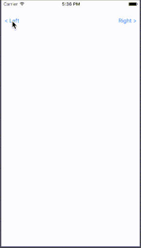

# Left Right Edge Swipe Custom Transition
Add custom left right edge swipe custom transition for present/dismiss & push/pop.

[![Swift Version][swift-image]][swift-url]
[](http://cocoapods.org/pods/LFAlertController)
[](http://makeapullrequest.com)



## Features

- [x] Custom transition
- [x] Edge swipe interactive transition
- [x] Supports both left and right swipes
- [x] Supports UINavigationController as well for custom push/pop transition

## Requirements

- iOS 8.0+
- Xcode 9.0

## Installation

#### Manually
1. Download and drop ```SwipeTransitionController.swift``` in your project.  
2. Congratulations!  

## Usage example

```swift
extension ViewController: SwipeAnimatorDelegate {
    var animator: SwipeAnimator? {
        return swipeAnimatorController
    }
}

override func viewDidLoad() {
     super.viewDidLoad()
        
     self.transitioningDelegate = SwipeTransitionController.shared
     interactiveRLSwipeContoller = SwipeInteractionController(viewController: self,
                                                                 isFromRightEdge: true,
                                                                 beganFunc: self.presentRightViewController)
     interactiveLRSwipeContoller = SwipeInteractionController(viewController: self,
                                                                 isFromRightEdge: false,
                                                                 beganFunc: self.presentLeftViewController)
}

func presentLeftViewController() {
     self.leftSwipeConfig()
     self.performSegue(withIdentifier: "LeftPush", sender: nil)
}
    
func presentRightViewController() {
     self.rightSwipeConfig()
     self.performSegue(withIdentifier: "RightPush", sender: nil)
}

// MARK: - Helpers

private func leftSwipeConfig() {
     swipeAnimatorController = SwipeAnimator()
     swipeAnimatorController?.isFromRightToLeft = false
     swipeAnimatorController?.transitionStyle = .plain
     swipeAnimatorController?.interactionController = interactiveLRSwipeContoller
}
    
private func rightSwipeConfig() {
    swipeAnimatorController = SwipeAnimator()
    swipeAnimatorController?.isFromRightToLeft = true
    swipeAnimatorController?.interactionController = interactiveRLSwipeContoller
}

```

## Contribute

We would love you for the contribution to **LeftRightEdgeSwipeCustomTransition**.

[swift-image]:https://img.shields.io/badge/swift-4.0-orange.svg
[swift-url]: https://swift.org/
[license-image]: https://img.shields.io/badge/License-MIT-blue.svg
[license-url]: LICENSE
[codebeat-image]: https://codebeat.co/badges/c19b47ea-2f9d-45df-8458-b2d952fe9dad
[codebeat-url]: https://codebeat.co/projects/github-com-vsouza-awesomeios-com
